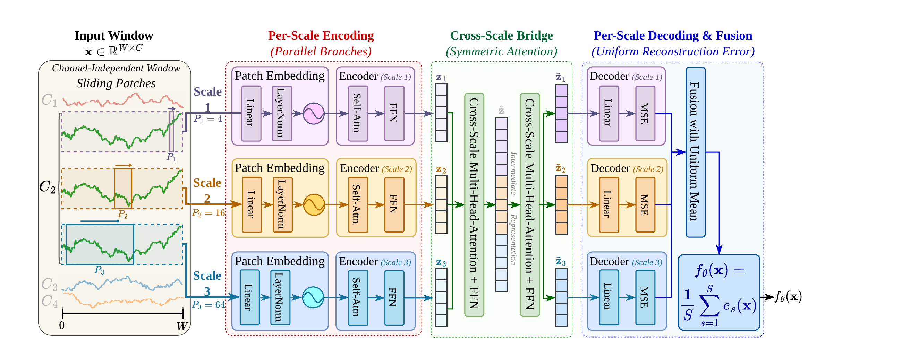
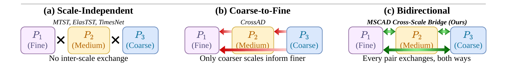

# MSCAD

Multi-scale autoencoders with bidirectional attention for time-series anomaly detection.

Companion implementation for **No Scale Left Behind: Multi-Scale Autoencoders with Bidirectional Attention for Time Series Anomaly Detection**, by Jiaheng Guo, Haochen Zhang, Morris Yu-Chao Huang, Jinhao Duan, Nicholas Konz, and Tianlong Chen.

[arXiv:2609.38004](https://arxiv.org/abs/2609.38004) · [Paper PDF](https://arxiv.org/pdf/2609.38004)

This release contains the MSCAD model, training and scoring code, a CSV runner, and tests. Datasets, saved results, weights, and exploratory models are not included.



*MSCAD architecture from the paper. Patch scales 4, 16, and 64 capture different temporal resolutions, exchange information through symmetric attention, and contribute equally to the window anomaly score.*

## Installation

Use Python 3.9 or newer (Python 3.11 recommended) with NumPy and PyTorch:

```bash
git clone https://github.com/jiaheng-guo/mscad.git
cd mscad
python -m venv .venv
source .venv/bin/activate
python -m pip install -e .
```

For a GPU, install the appropriate [PyTorch build](https://pytorch.org/get-started/locally/) for your system. The detector chooses CUDA when available, otherwise CPU; `device="cpu"` or `--device cpu` overrides this.

## Python usage

```python
import numpy as np
from mscad import MSCAD

# Replace this synthetic example with your own series.
rng = np.random.default_rng(1)
train = rng.normal(size=(512, 2)).astype("float32")
test = rng.normal(size=(256, 2)).astype("float32")
test[100:110] += 4

detector = MSCAD(seed=1)
detector.fit(train)                       # normal training prefix only
scores = detector.decision_function(test) # shape (256,); larger means more anomalous
```

Inputs have shape `(timestamps, channels)`; a one-dimensional array is accepted for a single channel. Labels are never used for training. The detector learns per-channel normalization from the training prefix and applies the same statistics at inference. It returns raw reconstruction scores without choosing an anomaly threshold.

## Run on CSV data

CSV files must have a header, numeric feature columns, and optionally a binary `Label` column (`0` normal, `1` anomalous). Missing or nonfinite values are rejected; rows are never silently removed. Training length is read from the TSB-AD filename segment `_tr_N_`, or set with `--train-length` for other filenames.

```bash
# One run on your own data.
python -m mscad --data data/series.csv --train-length 1000 \
  --seeds 1 --output-dir outputs/example

# Repeat with the public release's five seeds (also the default).
python -m mscad --data data/series.csv --train-length 1000 \
  --seeds 1 2 3 4 5 --output-dir outputs/five-seeds
```

Each run writes a NumPy score vector (`.npy`) and a JSON record of its seed, settings, input hash, scoring region, software versions, and optional metrics. Existing runs are not overwritten. All generated artifacts are ignored by Git. There are no separate seed configuration files.

By default, `--score-region test` scores **only the held-out suffix**, starting at the training length. The output vector therefore has `total_length - train_length` entries. `--score-region full` instead scores the complete trajectory, including its training prefix, as the older local benchmark scripts did. These protocols can produce different metrics and must not be mixed.

### TSB-AD evaluation

Download the data and evaluation file lists from the [official TSB-AD repository](https://github.com/TheDatumOrg/TSB-AD). They remain external to this repository. Install the optional metric dependency:

```bash
python -m pip install -e '.[evaluation]'

python -m mscad \
  --data-dir data/TSB-AD-U \
  --file-list data/File_List/TSB-AD-U-Eva.csv \
  --evaluate --output-dir outputs/tsb-ad-u
```

The file list must have a `file_name` column. Use the corresponding multivariate directory and evaluation list for TSB-AD-M. Only the files you select are run; no tuning results or hidden per-file settings are loaded.

Evaluation uses `TSB-AD==1.5` and passes raw scores to its official metric routine. The runner records AUC-PR, AUC-ROC, VUS-PR, and VUS-ROC. It does not report the routine's oracle-threshold F1 metrics. Both label classes must occur in the scored region. The VUS tolerance window is estimated from the first channel of that region using the upstream autocorrelation helper; `--metric-window N` overrides and records it. Installing this optional extra also installs TSB-AD's broader dependency set; scoring alone needs only NumPy and PyTorch.

## Model and defaults

Each channel is processed by the same network. Three branches extract overlapping patches, encode them with Transformers, exchange information through symmetric cross-attention, and reconstruct the patches. Within each bridge block, every scale attends to the other scales' tokens from the **same pre-update snapshot**. This avoids privileging whichever scale happens to be processed first.



*Cross-scale interaction patterns from the paper. MSCAD allows every pair of scales to exchange information in both directions.*

Per-scale reconstruction errors are averaged uniformly. Window scores are averaged over the timestamps they cover, then scores are averaged across channels.

| Setting | Default |
|---|---|
| Window length / window stride | 128 / 2 |
| Patch sizes / patch strides | `[4, 16, 64]` / half the patch size |
| Token dimension / attention heads | 256 / 4 |
| Encoder layers per scale / bridge blocks | 2 / 2 |
| Fusion / training objective | Uniform mean / reconstruction MSE |
| Optimizer / learning rate | Adam / `1e-3` |
| Scheduler / gradient clipping | Cosine decay / norm 1.0 |
| Maximum epochs / patience | 30 / 5 |
| Batch size / validation fraction | 128 / 0.1 |
| Dropout / precision | 0.1 / float32 |
| Python API seed / CLI seeds | 1 / `[1, 2, 3, 4, 5]` |

The implementation retains patch-embedding LayerNorm and learned positional embeddings from the surviving source. Validation uses a random holdout of overlapping training windows, so training and validation windows can share timestamps; it is not a disjoint temporal validation split. At least two channel-windows are required to fit. Short inference sequences are zero-padded after normalization, and uncovered tail timestamps receive the last covered score. Validation and inference run in batches.

Patch sizes must be distinct even integers no larger than the window, and each scale must fit within the 512-position embedding table. Invalid configurations raise an error instead of silently changing the architecture. Seeds are reset for every fit; numerical identity across devices or PyTorch versions is not guaranteed.

## Release provenance

This is a cleaned reconstruction from the surviving research code and the manuscript's stated configuration. The final GPU experiment snapshot is unavailable, so this release does **not** claim exact reproduction of the paper's reported numbers. Seeds 1–5 define new runs; they do not relabel historical runs.

The default follows the manuscript's explicit **256-dimensional, two-bridge-block** architecture. With the retained implementation, this has **6,756,692** trainable parameters. The manuscript's approximately 5.97M count instead corresponds to one bridge block (**5,966,932** parameters). The two-block architecture is retained here, and the discrepancy remains unresolved against the lost snapshot.

Unused gating, diversity, spectral, and memory-bank paths were removed. Training uses reconstruction MSE only. Early stopping counts epochs without a strict validation improvement, matching the manuscript pseudocode; the old helper used a small minimum-improvement tolerance. Input validation, batched validation, and explicit scoring-region selection make the surviving implementation usable without lab-specific paths or scripts. Full benchmark results have not been regenerated with this release.

## Development

```bash
python -m pip install -e '.[test]'
python -m pytest -q
python -m mscad --help
```

| File | Purpose |
|---|---|
| `mscad/model.py` | Patch encoders, symmetric bridge, reconstruction network |
| `mscad/detector.py` | Input validation, normalization, training, inference |
| `mscad/scoring.py` | Covering-window score averaging |
| `mscad/cli.py` | CSV loading, repeated runs, optional evaluation |
| `tests/` | CPU model, detector, and runner checks |

The evaluation protocol and metrics build on Qinghua Liu and John Paparrizos, *The Elephant in the Room: Towards A Reliable Time-Series Anomaly Detection Benchmark*, NeurIPS 2024. Please cite that work when using TSB-AD.

## License

MSCAD code is released under the [MIT License](LICENSE). External datasets and dependencies retain their own licenses.
